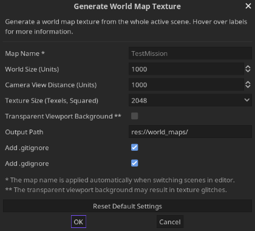

# World Map Texture Generation Tool

Generate world map textures from whole 3D scenes in Godot Engine 3.5+.

⚠ **FRIENDLY WARNING** ⚠

This plugin is in a very early state. Please make sure to always backup your project files before performing any actions!

## Installation
1. Close Godot Editor if currently open.
2. Move directory **bifractal-world-map-texture-gen-tool** to your project's **addons/** folder.
3. Re-open Godot Editor, open your project and go to the **Project Settings / Plugins** tab.
4. Activate plugin by checking **Enable** for **World Map Texture Generation Tool**.

## How-To
1. Open any Spatial scene and look for the **Generate World Map** button in the upper toolbar.
2. Click that button and adjust the settings from the dialog window.
3. Click **OK** to generate the world map texture.

If everything went fine, you can find the map texture inside the given output path (default **res://world_maps/** - inside the root directory of your project).

## User Interface

## Example
### Map in Viewport

### Map Texture Result (Low Resolution)

Since the texture is generated from a very high "altitude", the quality of meshes might be low due to low levels of detail. This issue may be fixed by using "tiled maps" in a future version. See [Future Versions](#future-versions) for more information.

## Known Issues
No known issues yet. Always check the output log for warnings and errors. In doubt, re-open a scene or the editor completely and try again. Feel free to open an issue on GitHub if you run into any problems.

## Future Versions
See [TODO.md](TODO.md) for detailed feature descriptions for future versions.

Thanks for using my software 💜
